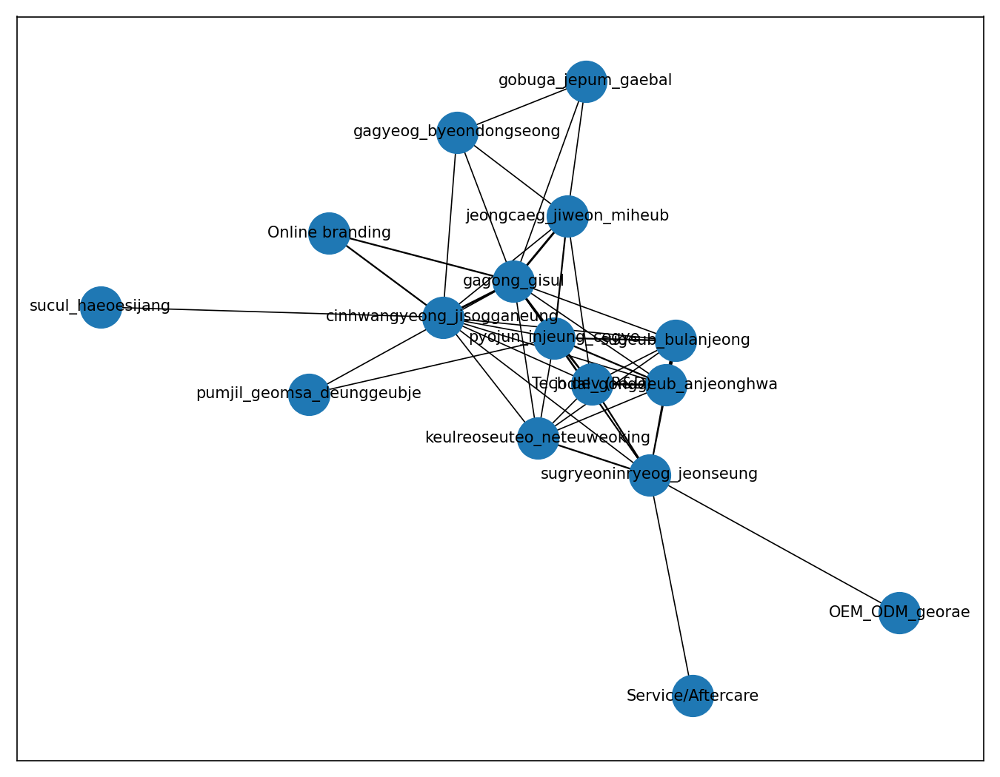
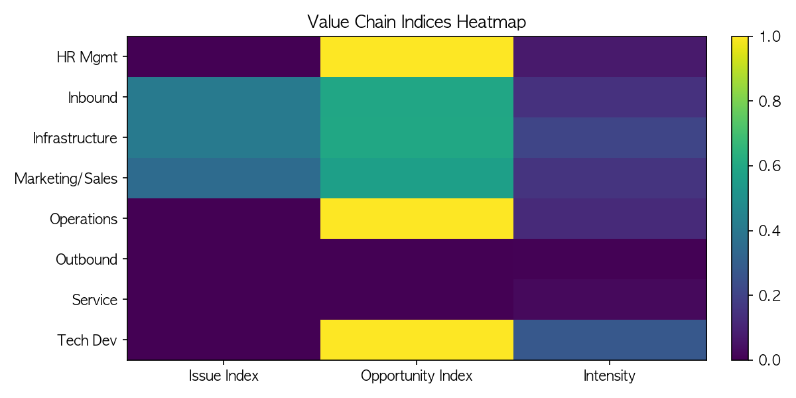

# Bamboo Value Chain × Open Coding (Python) — Starter Kit

인터뷰 PDF를 **개방 코딩(Open Coding)**으로 정량화하고, **가치사슬(Value Chain)** 단계에 매핑하여 **문제·기회·강도 지표**를 만드는 파이프라인입니다. 히트맵/네트워크 시각화와 자동 리포트까지 한 번에 생성합니다.

---

## ✨ What is this project?
- **목적**: 질적 인터뷰 내용을 규칙 기반으로 체계화해 **우선 개입 포인트**(핫스팟)와 **기회 영역**을 데이터로 제시
- **핵심 아이디어**: 
  1) 인터뷰 문장을 세분화 → 
  2) **코드북(YAML)**의 동의어/정규식으로 **룰 기반 코딩** → 
  3) 각 코드를 **가치사슬 단계**에 연결 → 
  4) 단계별 **문제/기회/강도 지표** 산출 → 
  5) **히트맵/네트워크**로 시각화 → 
  6) **Markdown 보고서** 자동 생성

---

## 🧱 Folder Structure
```
bamboo_value_chain_starter/
  ├─ data/
  │   ├─ raw/                # 인터뷰 원본 PDF 넣기
  │   └─ processed/          # 추출/세그먼트/라벨링 중간 산출물
  ├─ outputs/
  │   ├─ figures/            # 히트맵/네트워크 등 그래프
  │   └─ tables/             # 빈도표/지수표/요약표
  ├─ src/
  │   ├─ extract_text.py
  │   ├─ segment_korean.py
  │   ├─ discover_codes.py
  │   ├─ codebook.yaml       # 코드북(사전) — 수동 편집
  │   ├─ apply_codebook.py
  │   ├─ map_value_chain.py
  │   ├─ metrics_and_viz.py  # 히트맵/네트워크/지수(한/영 라벨)
  │   └─ generate_report.py
  ├─ config/
  │   └─ metadata.csv        # (선택) 인터뷰이 메타데이터(역할/지역/날짜 등)
  └─ notebooks/
      └─ 00_quickstart.md    # 빠른 시작 가이드
```

> **주의**: 코드북 경로는 `src/codebook.yaml`입니다. (기존 문서의 `config/codebook.yaml` 언급을 통일하여 수정)

---

## 🛠 Tech Stack
- **Python 3.12+**
- **pandas**, **pyarrow** (데이터 프레임/컬럼 저장)
- **kss**(mecab/pecab backend) (한국어 문장 분할)
- **scikit-learn** (TF‑IDF, NMF)
- **regex**, **PyYAML** (정규식/코드북)
- **matplotlib**, **networkx** (그래프/네트워크 시각화)
- **tqdm** (진행률), **unidecode**(옵션: 영문 라벨 강제)

---

## 🚀 Quickstart
```bash
# (선택) 가상환경
python -m venv .venv && source .venv/bin/activate
python -m pip install --upgrade pip

# 의존성 설치
pip install pandas pyarrow kss scikit-learn regex pyyaml matplotlib networkx tqdm unidecode

# 1) PDF 배치
cp your_pdfs/*.pdf data/raw/

# 2) 파이프라인 실행
python src/extract_text.py           # PDF → text
python src/segment_korean.py         # 문장 세그먼트(화자 1/2 구분)
python src/discover_codes.py         # TF-IDF 후보/NMF 토픽
# src/codebook.yaml 편집(동의어/정규식, vc_stage, polarity, weight)
python src/apply_codebook.py         # 룰 기반 코딩
python src/map_value_chain.py        # 단계×코드 집계표
python src/metrics_and_viz.py        # 지표/히트맵/네트워크
python src/generate_report.py        # 보고서(Markdown)
```

### 환경 변수
- `FAST_SEG=1` : 세그먼트 속도 우선(정확도↓)
- `LABEL_LANG=ko|en` : 그림 라벨 언어 한/영 전환
- `FONT_PATH=/Library/Fonts/NotoSansCJKkr-Regular.otf` : 한글 폰트 강제(□ 방지)

---

## 🧩 Method (개요)
- **Open Coding**: 문장에 의미 라벨(코드) 부여
- **Codebook (YAML)**: `synonyms`(키워드/정규식), `vc_stage`(가치사슬), `polarity`(−1/0/+1), `weight`
- **Value Chain Mapping**: 코드 → 단계(조달/가공/출고/마케팅/서비스/기술개발/인력/구매/인프라)
- **Indices**
  - *Issue* = 부정 코드 비율, *Opportunity* = 긍정 코드 비율,
  - *Intensity* = 전체 코딩 중 해당 단계 언급 비중(share)
- **Co-occurrence Network**: 같은 세그먼트에서 함께 등장한 코드 쌍(전략 묶음 탐색)

---

## 📦 Outputs (Cheat Sheet)
- `outputs/tables/value_chain_counts.csv` : 단계×코드 빈도/감성/가중치 집계
- `outputs/tables/value_chain_indices.csv` : 단계별 Issue/Opportunity/Intensity 지수
- `outputs/figures/heatmap_indices.png` : 가치사슬 지표 히트맵
- `outputs/figures/cooccurrence_network.png` : 코드 공동출현 네트워크
- `outputs/bamboo_value_chain_report.md` : 자동 요약 리포트

---

## 🔧 Codebook 예시
```yaml
- code: 자동화_부족
  synonyms: ["자동화 설비 부족", "수작업 위주", "설비 노후화", "공정 효율 저하"]
  vc_stage: operations
  polarity: -1
  weight: 1.0

- code: 유통_출고_물류
  synonyms:
    - "(주문|발주|납품|거래처).{0,20}(배송|출고|택배|운송)"
    - "(배송|출고|택배|운송).{0,20}(주문|발주|납품|거래처)"
    - "포장( 작업| 공정)?"
  vc_stage: outbound_logistics
  polarity: 0
  weight: 1.0
```

---

## 🧪 Reproducibility
- 코드북과 스크립트 버전을 커밋하면 동일 입력에서 동일 결과를 재현 가능
- 보고서/그림/표는 모두 `outputs/`에 저장되며, 계산식은 `metrics_and_viz.py`에 명시

---

## 🐞 Troubleshooting
- **한글이 네모(□)로 보일 때**: `FONT_PATH`로 CJK 폰트 지정 후 `metrics_and_viz.py` 재실행
- **세그먼트가 너무 느릴 때**: `FAST_SEG=1` 또는 `pecab` 백엔드 사용
- **OutBound 과다 매칭**: 코드북 정규식에 **동시출현 간격 제약**(예: `{0,20}`)을 적용해 잡음 감소


---

## 결과 미리보기

