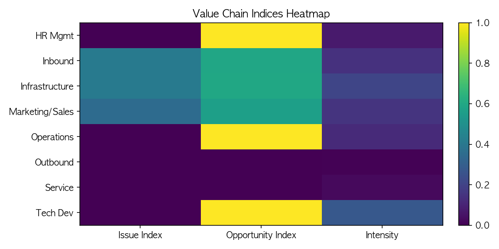
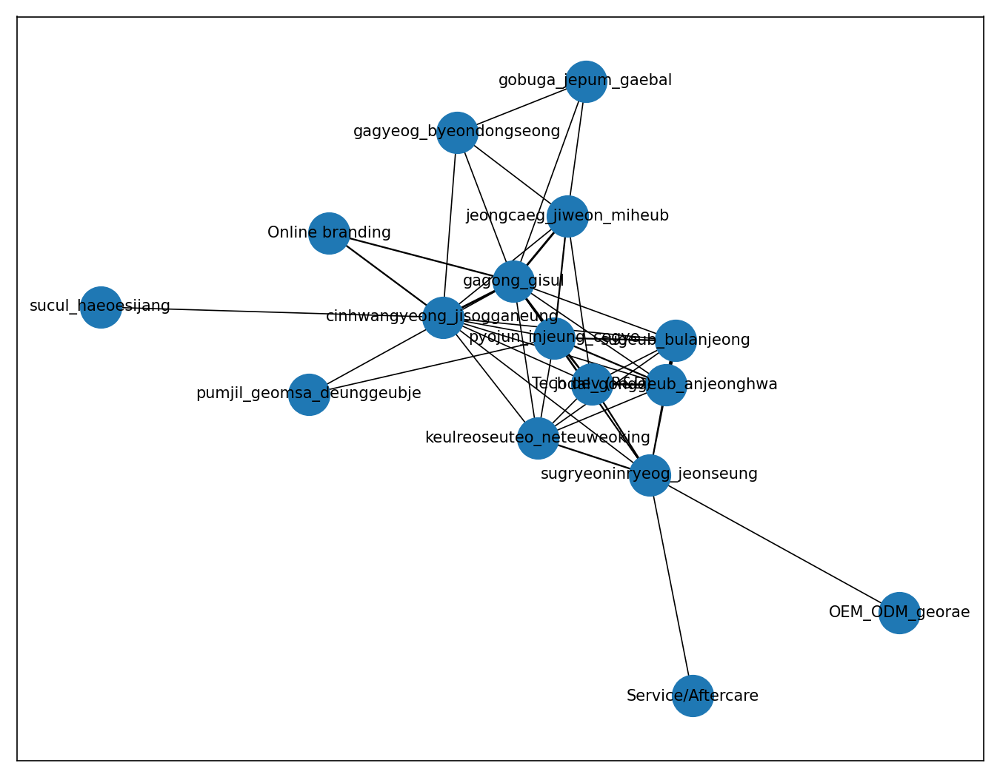

# 대나무 산업 이윤 추구: 가치사슬 × 개방 코딩 분석 보고서

- 생성 시각: 2025-10-21 19:18

## 1) 요약
- 본 보고서는 인터뷰 텍스트를 코딩하여 가치사슬 단계별 문제/기회/강도를 정량화하였습니다.

## 2) 가치사슬 지표(요약)
**빈도 상위 단계**
- tech_dev: 42
- infrastructure: 32
- marketing_sales: 23
- inbound_logistics: 22
- operations: 18
- hr_mgmt: 11
- service: 4
- outbound_logistics: 1

## 3) 시각화

